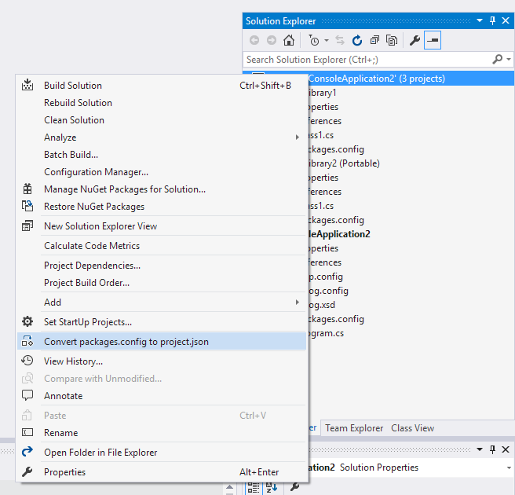
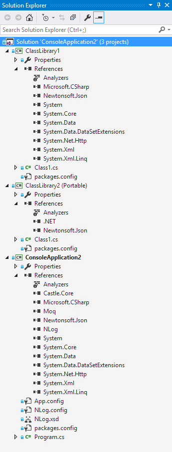
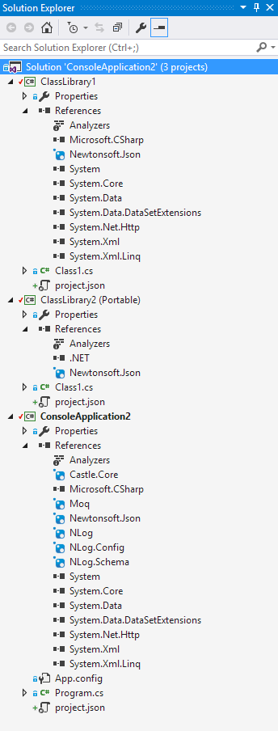

# NuGet Package Updater

[](https://ci.appveyor.com/project/twsouthwick/nugetpackageconfigconverter)

Download this extension from the [VS Gallery](https://visualstudiogallery.msdn.microsoft.com/8e8e8c73-e874-4180-9a44-1c9ebffd308d) or the [CI build](http://vsixgallery.com/extension/NuGetPackageConfigConverter.Taylor%20Southwick.dd0141da-d26f-4013-8b78-72723a313486/).

---------------------------------------

This will convert projects that are using NuGet dependencies via `packages.config` or `project.json` to the newer `PackageReference` format. There are many benefits
to using this new format even in non-.NET Core projects (where it is required). Some of them include:

- Transitive dependencies are automatically included - you only need to include the dependencies you need
- install.ps1/uninstal.ps1 is not run so arbitrary code is not run on install and uninstall from untrusted packages
- Doesn't rewrite your project file
- Doesn't add extra files to the project

In order to run, right-click the Solution in `Solution Exporer` and click `Upgrade to Package References`: 



After selecting that, the project will be transformed as shown below. It is highly recommended that you perform this on a source-control enabled
directory so you can easily undo if something goes wrong.

|  Before                                   | After                                   |
|-------------------------------------------|-----------------------------------------|
|  |  |

Please file any issues if something does not work as expected.

## Sample diff

In addition to deleting the `packages.config` file, the csproj file will be modified. Here's an example diff:

```diff
diff --git a/Gravatar/Gravatar.csproj b/Gravatar/Gravatar.csproj
index e33bdc720..e622d6602 100644
--- a/Gravatar/Gravatar.csproj
+++ b/Gravatar/Gravatar.csproj
@@ -34,4 +34,5 @@
     <TargetFrameworkProfile>
     </TargetFrameworkProfile>
+    <RestoreProjectStyle>PackageReference</RestoreProjectStyle>
   </PropertyGroup>
   <PropertyGroup Condition=" '$(Configuration)|$(Platform)' == 'Debug|AnyCPU' ">
@@ -61,8 +62,4 @@
     <Reference Include="System" />
     <Reference Include="System.Drawing" />
-    <Reference Include="System.IO.Abstractions, Version=2.0.0.144, Culture=neutral, processorArchitecture=MSIL">
-      <HintPath>..\packages\System.IO.Abstractions.2.0.0.144\lib\net40\System.IO.Abstractions.dll</HintPath>
-      <Private>True</Private>
-    </Reference>
   </ItemGroup>
   <ItemGroup>
@@ -95,7 +92,4 @@
     </BootstrapperPackage>
   </ItemGroup>
-  <ItemGroup>
-    <None Include="packages.config" />
-  </ItemGroup>
   <ItemGroup>
     <ProjectReference Include="..\Externals\Git.hub\Git.hub\Git.hub.csproj">
@@ -106,6 +100,10 @@
   </ItemGroup>
   <ItemGroup>
-    <Analyzer Include="..\packages\StyleCop.Analyzers.1.1.0-beta006\analyzers\dotnet\cs\StyleCop.Analyzers.CodeFixes.dll" />
-    <Analyzer Include="..\packages\StyleCop.Analyzers.1.1.0-beta006\analyzers\dotnet\cs\StyleCop.Analyzers.dll" />
+    <PackageReference Include="StyleCop.Analyzers">
+      <Version>1.1.0-beta006</Version>
+    </PackageReference>
+    <PackageReference Include="System.IO.Abstractions">
+      <Version>2.0.0.144</Version>
+    </PackageReference>
   </ItemGroup>
   <Import Project="$(MSBuildToolsPath)\Microsoft.CSharp.targets" />
```

## License
[Apache 2.0](LICENSE)
